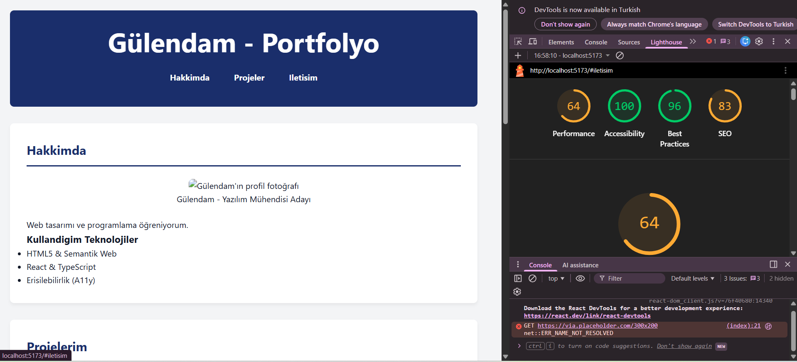

# Web LAB -1 - Hello Project

 ## Hakkinda
 Bu proje , Web Tasarimi ve Programlama dersi LAB -1 kapsaminda
 Vite + React + TypeScript kullanilarak olusturulmustur.

## Gelistirici
 - **Ad Soyad:** [Gülendam Oral]
- **Ogrenci No:** [230541014]

 ## Kullanilan Teknolojiler
- React 
 - TypeScript
 - Vite

 ## Kurulum
 ```bash
 npm install
 ```
 ## Calistirma
 ```bash
 npm run dev
 ```
 Tarayicida http://localhost:5173 adresini ac.

 ## Ekran Goruntusu
 (ekran goruntusunu buraya ekle)
 ## Lighthouse Erişilebilirlik Raporu

## 🎨 CSS Kararları ve Teknik Tercihler

Bu proje, LAB-3 kapsamında Modern CSS prensipleri ve Mobile-First yaklaşımıyla geliştirilmiştir. Tasarım sürecinde alınan temel kararlar aşağıdadır:

### 1. Breakpoint (Kırılım Noktası) Seçimi
* [cite_start]**Tercih edilen değerler:** 640px (Tablet) ve 1024px (Masaüstü)[cite: 133, 134].
* [cite_start]**Gerekçe:** İçeriğin okunabilirliğini korumak adına standart cihaz genişliklerini hedefleyen bu noktalar seçilmiştir[cite: 136]. [cite_start]Mobil görünüm varsayılan kabul edilmiş, min-width medya sorguları ile genişletilmiştir[cite: 22, 62].

### 2. Layout (Yerleşim) Tercihleri
* [cite_start]**Flexbox (Header & Nav):** Navigasyon çubuğu ve logo hizalaması gibi tek boyutlu düzenler için Flexbox kullanılmıştır[cite: 26, 372]. [cite_start]Bu sayede elemanlar arası boşluklar (gap) kolayca yönetilmiştir[cite: 480].
* [cite_start]**CSS Grid (Proje Kartları):** İki boyutlu proje galerisi için Grid yapısı tercih edilmiştir[cite: 27, 489]. [cite_start]`repeat(auto-fit, minmax(280px, 1fr))` satırı sayesinde medya sorgusu yazmadan her ekrana uyum sağlayan akıllı bir ızgara oluşturulmuştur[cite: 534, 863].

### 3. Tasarım Sistemi (Design Tokens)
* [cite_start]**Merkezi Yönetim:** Renk, boşluk (spacing), kenar yuvarlaklığı (radius) ve gölge gibi kararlar `:root` altında CSS değişkenleri olarak tanımlanmıştır[cite: 25, 147]. [cite_start]Bu, projenin tamamında görsel tutarlılık sağlar[cite: 290].
* [cite_start]**Fluid Typography:** Yazı boyutları sabit pikseller yerine `clamp()` fonksiyonu ile tanımlanmıştır[cite: 24, 319]. [cite_start]Böylece fontlar ekran genişliğine göre akıcı ve kademesiz şekilde ölçeklenir[cite: 319, 344].

### 4. Responsive Stratejiler
* [cite_start]**Mobile-First:** CSS kodları önce en küçük ekranlar için yazılmış, daha yetenekli cihazlar için ekleme stratejisi izlenmiştir[cite: 22, 58].
* [cite_start]**Görsel Optimizasyonu:** Kart içindeki görsellerin orantısız bozulmasını önlemek için `object-fit: cover` kuralı uygulanmıştır[cite: 823, 872].